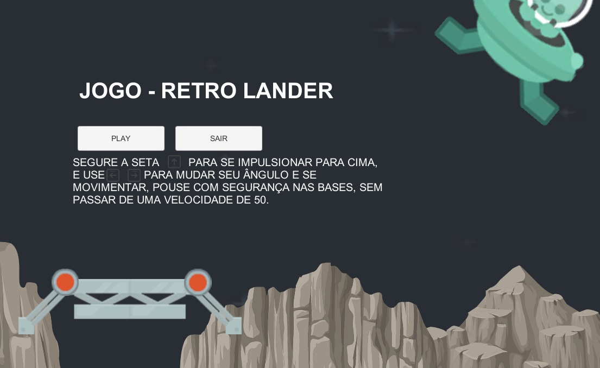

# Jogo - Retro Lander
Por: [***Francisco Henrique***](https://www.linkedin.com/in/francisco-henrique-010912189)

### -Projeto desenvolvido utilizando á *Game Engine* [Unity](https://unity.com/) com C#.

## Objetivo
- Apresentar e Orientar como funciona o Game Retro Lander, Projeto 2D.

### Gameplay
- O jogo possui apenas uma fase, onde seu objetivo é pousar a nave em segurança em uma das plataformas, você deve controlar o ângulo da nave e sua propulsão, para não colidir com muita velocidade nas plataformas e explodir ao pousar.

### Controles
* **Seta direcional para Cima:** Impulsiona a Nave para o ângulo em que a nave está direcionada.
* **Seta direcional Esquerda:** Rotaciona o ângulo da nave para a esquerda.
* **Seta direcional Direita:** Rotaciona o ângulo da nave para a direita.

## Para Executar:
* WEB: Na pasta Executável-WEB Rode o arquivo index.html e ele abrirá no seu navegador.
* PC: Na pasta Executável-PC rode o arquivo RetroLander.exe e ele abrirá em sua máquina.
